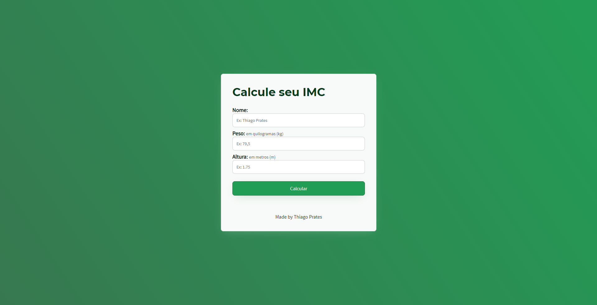

# Projeto IMC

Projeto com a função de calcular o IMC de uma pessoa através do peso e da altura do usuário. E assim dizer em qual situação o usuário se encontra.#

### Tecnologias:

- HTML
- CSS
- JS
